# MyTV UI 高保真设计提案 v2

> 状态：方向已拍定（A 暗夜影院），全套页面设计已补齐。本文档为设计交付物，不放行任何代码。
> 日期：2026-09-28
> 依据：`01-总体设计方案.md` v4 第 9.2（视觉品质）、9.3（三端响应式）；待拍板项 #10 按 c 执行。
> 修订：v2（2026-09-28）— #10 已拍 A；补齐搜索/我的/登录（电脑+手机）、平板（首页/播放页）、后台（仪表盘/数据源管理）共 10 张；新增第 7 节交互与实现规格。

## 1. 范围

- 本次交付：2 个视觉方向 ×（首页 + 播放页）×（电脑 1440px + 手机 390px）= 8 张高保真稿。
- 方向拍定后补齐：平板视图、搜索/详情/我的/登录/后台全套页面、交互与动效规格。
- 实现注记：设计稿中播放页「来源/线路」出现的爱优腾字样为 AI 占位；实际实现显示**采集站线路名**（线路一 / 源名称），数据源逻辑不变。

## 2. 方向 A「暗夜影院」✅ 已拍定（2026-09-28）

深黑沉浸风，对标 Netflix / Disney+：暗色让海报与播放器成为绝对主角，红色作为唯一强调色制造影院仪式感。

### 设计令牌

| 令牌 | 值 | 用途 |
|---|---|---|
| 底色 | `#0B0E14` / `#131822` / `#1B2230` | 页面 / 卡片 / 悬浮层 |
| 主色 | 绯红 `#E8112D` | 播放键、进度条、Logo、激活态 |
| 评分 | 金黄 `#F5C518` | 评分星与分数 |
| 文字 | `#F2F4F8` / `#9AA3B2` / `#5C6675` | 主 / 次 / 弱 |
| 圆角 | 海报 8px、卡片 12px、按钮全圆角 | — |
| 效果 | Hero 左黑渐变遮罩；海报 hover 放大 + 红光晕 | — |

### 首页 · 电脑
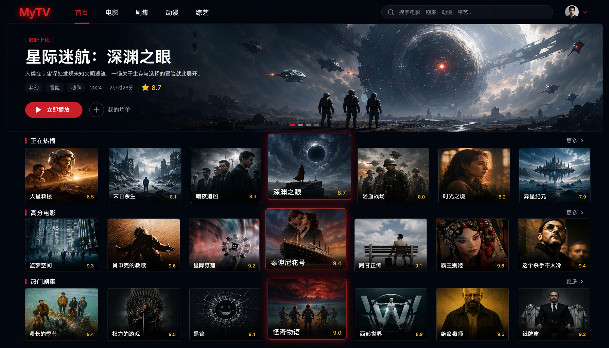
顶部导航（Logo + 分类 + 搜索 + 头像）→ 全宽 Hero 轮播（大标题、类型/评分元信息、立即播放 + 我的片单）→ 横排海报分区（正在热播/高分电影/热门剧集，每区 6–8 张可横滑，标题叠加于海报下缘渐变上）。

### 首页 · 手机
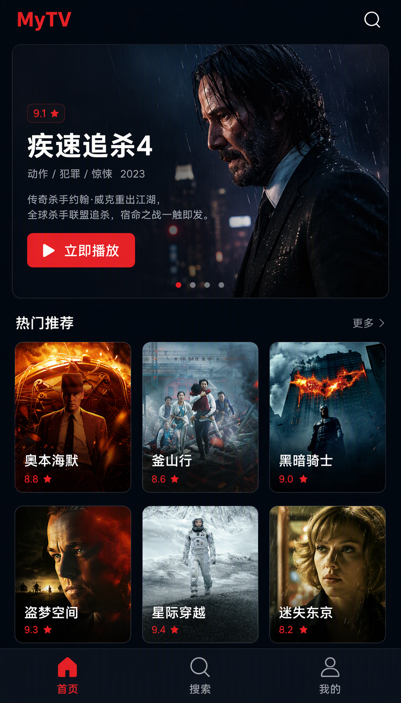
紧凑顶栏（Logo + 搜索图标）→ Hero 卡片轮播 → 3 列海报网格（标题 + 评分叠于海报上）→ 底部标签栏（首页/搜索/我的）。

### 播放页 · 电脑
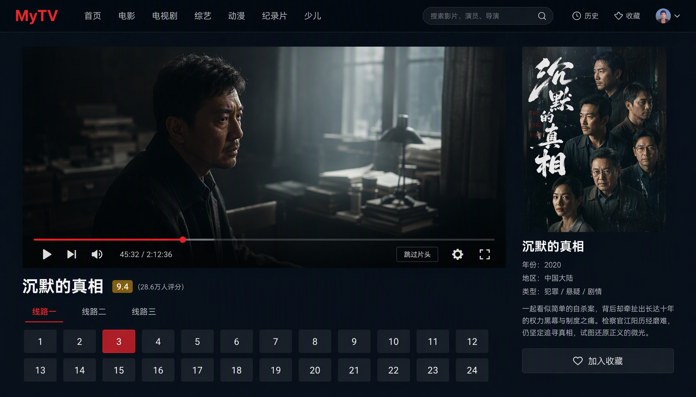
左主区：16:9 播放器（红色进度、跳过片头、设置、全屏）→ 标题 + 评分 → 线路 tabs → 选集网格（当前集红色高亮）；右侧栏：海报 + 元信息 + 简介 + 加入收藏。

### 播放页 · 手机
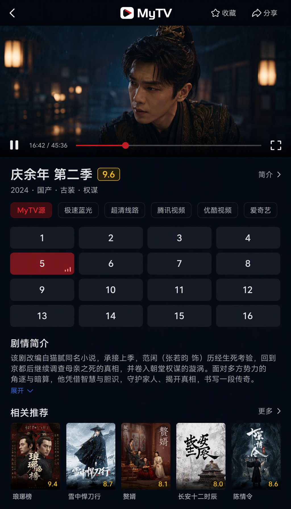
顶部播放器（支持全屏沉浸）→ 标题/评分/简介入口 → 线路 pills → 选集 4 列网格 → 剧情简介（可展开）→ 相关推荐横滑。

## 3. 方向 B「雾光玻璃」

浅色杂志风 + 玻璃拟态：雾白底、磨砂导航、靛蓝主色，大量留白与细分隔线，走"内容杂志"的清新辨识度路线。

### 设计令牌

| 令牌 | 值 | 用途 |
|---|---|---|
| 底色 | `#F5F6F8` / `#FFFFFF` | 页面 / 卡片 |
| 主色 | 靛蓝 `#4F46E5` | 按钮、激活 tab、进度 |
| 评分 | 琥珀 `#F59E0B` 徽章（白字） | 海报角标 |
| 文字 | `#111827` / `#6B7280` | 主 / 次 |
| 圆角 | 卡片 16px、 pills 全圆角 | — |
| 效果 | 导航/底栏 `backdrop-blur` 磨砂；卡片软阴影 | — |

### 首页 · 电脑
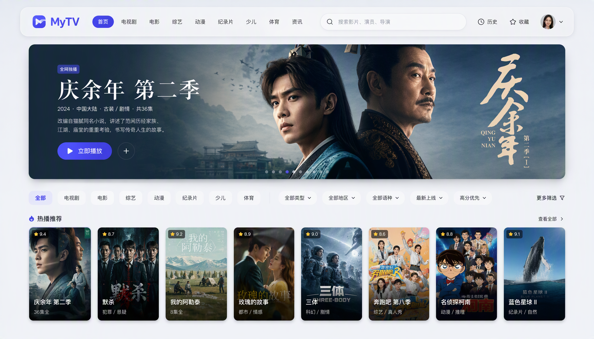
磨砂玻璃导航 → 大圆角 Hero 卡片 → 分类筛选 pills 行 → 海报网格（评分角标 + 类型标签 + 集数信息），杂志式疏朗排版。

### 首页 · 手机
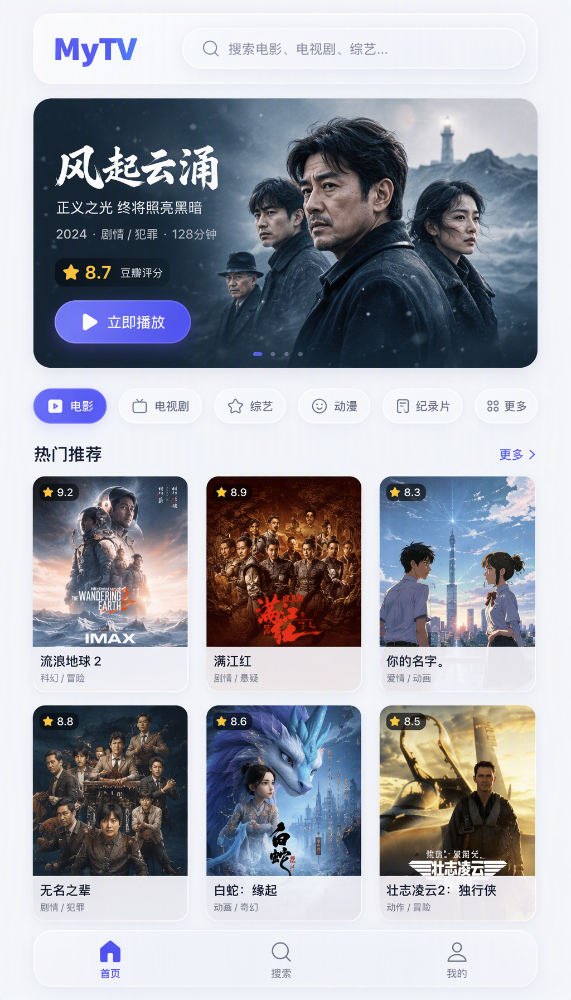
玻璃顶栏 + 圆角搜索 pill → Hero 卡 → 分类 pills → 3 列海报网格（评分角标、标题与类型在卡下）→ 磨砂底栏。

### 播放页 · 电脑
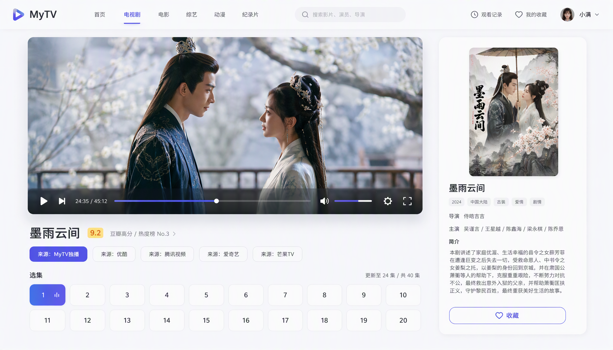
圆角播放器卡片浮于浅底（磨砂控制条）→ 标题 + 榜单标签 → 来源 pills → 选集 chips → 右侧白色信息卡（海报/元信息/简介/收藏）。

### 播放页 · 手机
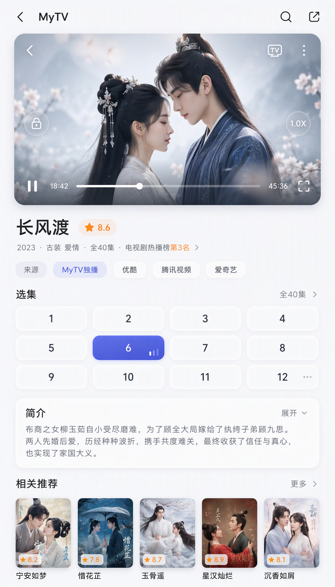
圆角播放器卡 → 标题/评分/榜签 → 来源 pills → 选集网格 → 白色简介卡 → 相关推荐横滑。

## 4. 对比与推荐

| 维度 | A 暗夜影院 | B 雾光玻璃 |
|---|---|---|
| 观感 | 沉浸、影院感、内容绝对主角 | 清新、杂志感、呼吸感 |
| 观影场景（夜间/弱光） | 优 | 一般；选 B 须一期加暗色模式 |
| 海报表现力 | 深色衬海报色彩，边缘融合 | 白底干净，但深色海报边缘对比突兀 |
| 差异化 | 与 Netflix 系同构，成熟稳妥 | 同类聚合站少见，辨识度高 |
| 实现成本 | 低（单暗色主题） | 中高（玻璃模糊需性能调优；暗色模式另算） |
| 主要风险 | 同质化 | 夜间体验差、主题翻倍维护成本 |

**推荐 A**。产品核心场景是"看片"，暗色为业界验证过的正解，且与 9.2 既定「默认暗色」一致、成本最低；B 的差异化代价是双主题维护。

## 5. 拍板记录

| # | 命题 | 结果 |
|---|---|---|
| 10 | UI 视觉方向 | ✅ **A 暗夜影院**（2026-09-28 拍定） |

以下为 A 方向全套页面与规格。

## 6. 全套页面设计（A 方向，共 18 张）

### 6.1 搜索页
电脑：大搜索框 + 热门搜索 chips + 左侧筛选（类型/地区/年份）+ 结果网格。
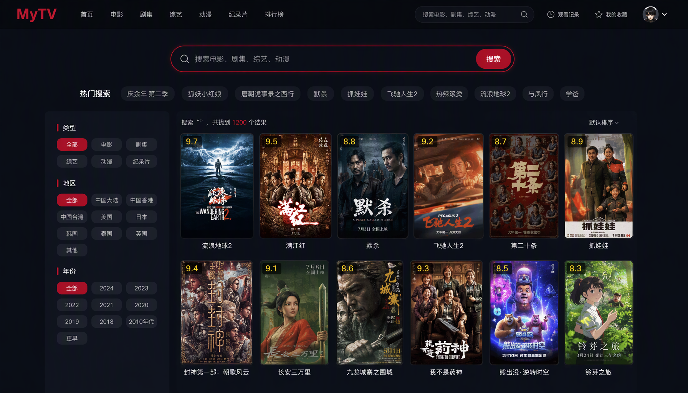
手机：搜索框 + 搜索历史 + 热搜榜 + 结果网格；底栏「搜索」高亮。
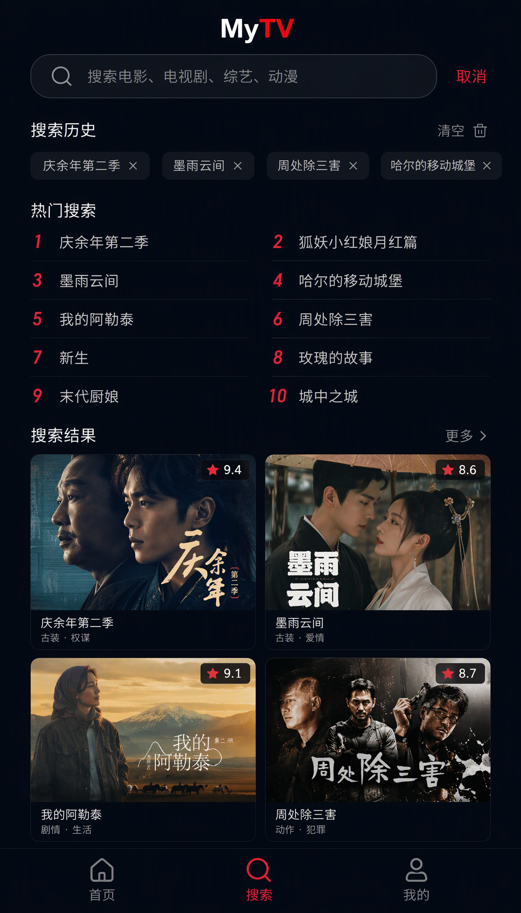

### 6.2 我的
电脑：用户卡 + tabs（收藏/历史/设置）+ 观看历史列表（带进度条、继续观看）+ 收藏网格。
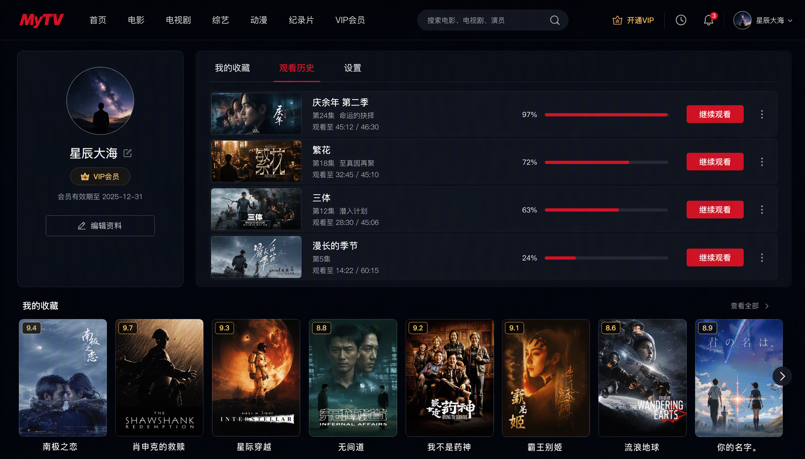
手机：用户卡 + 功能列表（含「管理后台」入口，仅管理员可见）+ 继续观看横滑。
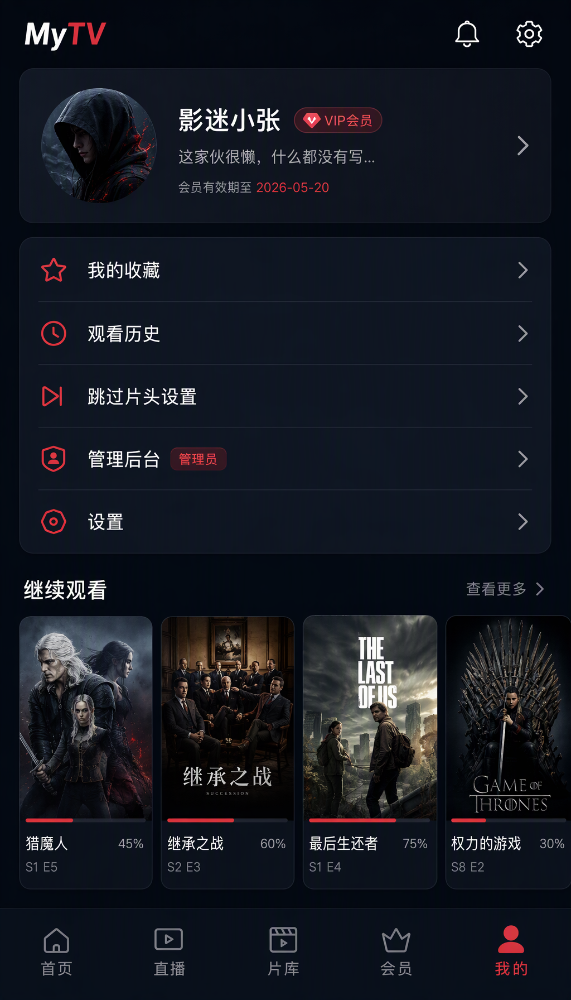

### 6.3 登录
电脑/手机同构：海报拼贴暗化背景 + 磨砂玻璃登录卡（账号/密码/登录/注册链接）。
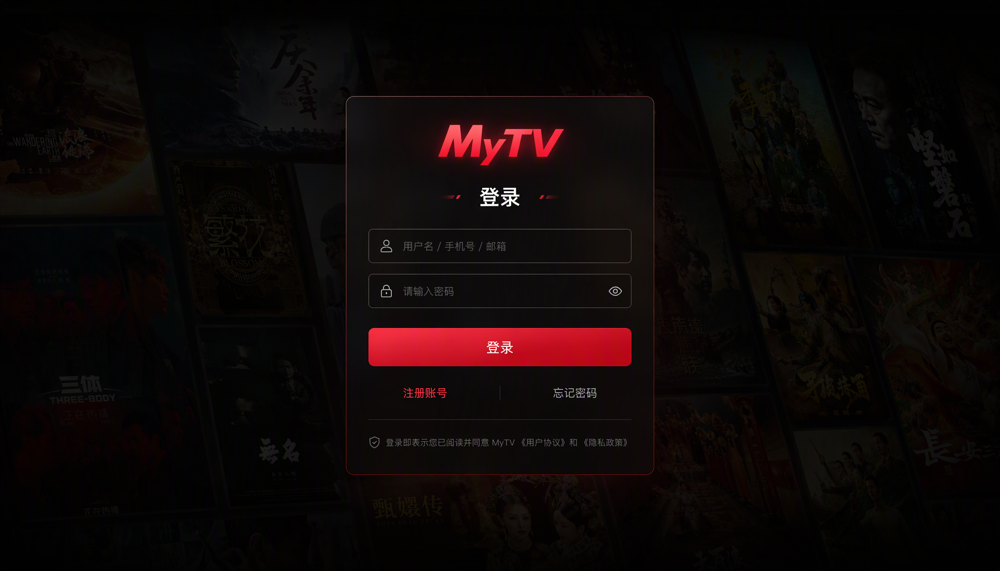
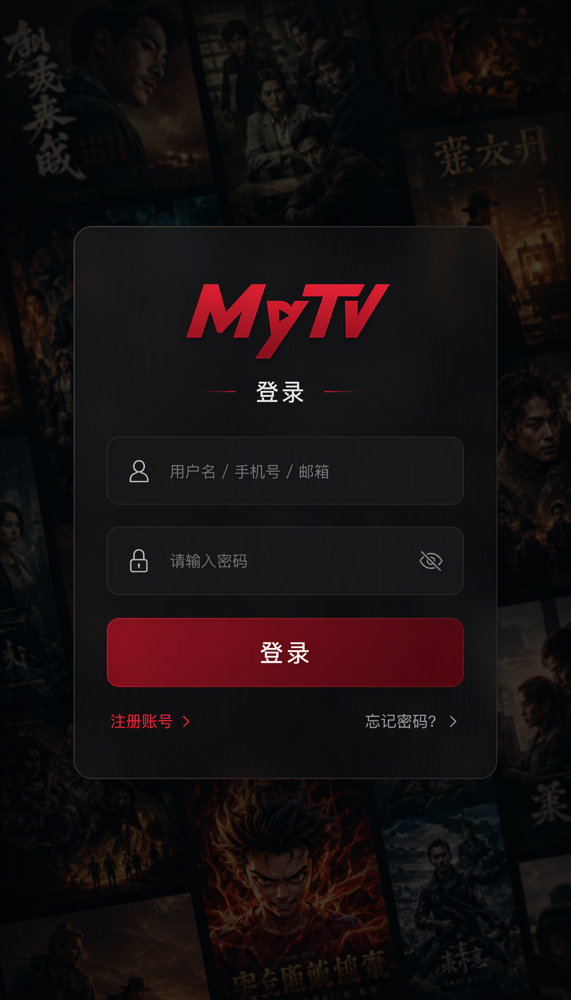

### 6.4 平板（横屏）
首页：紧凑顶导航 + Hero + 5 列海报分区。
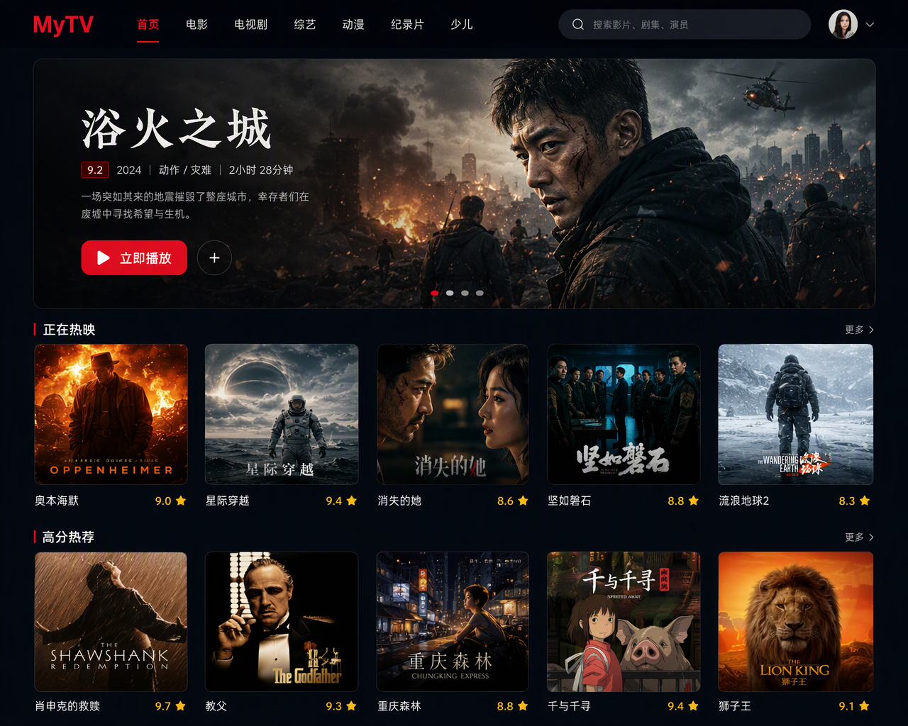
播放页：左 2/3 播放器 + 选集，右 1/3 信息栏。
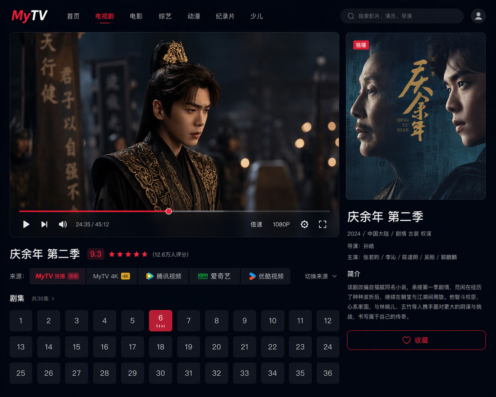

### 6.5 后台管理（桌面优先）
仪表盘：统计卡（注册用户/今日播放/收录影片/源可用率）+ 近 7 日播放趋势 + 数据源可用率 + 最新注册用户。
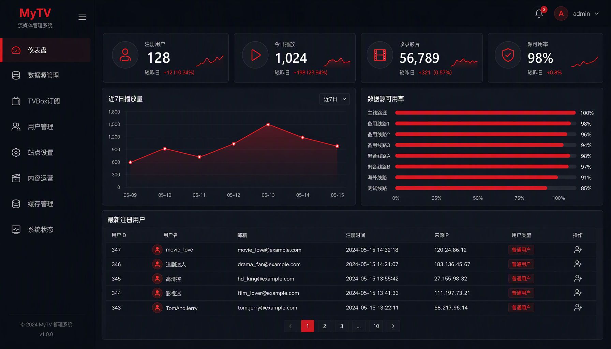
数据源管理：源表格（名称/接口地址/权重/成人源/状态/启用/操作）+ 添加数据源 + TVBox 订阅导入。
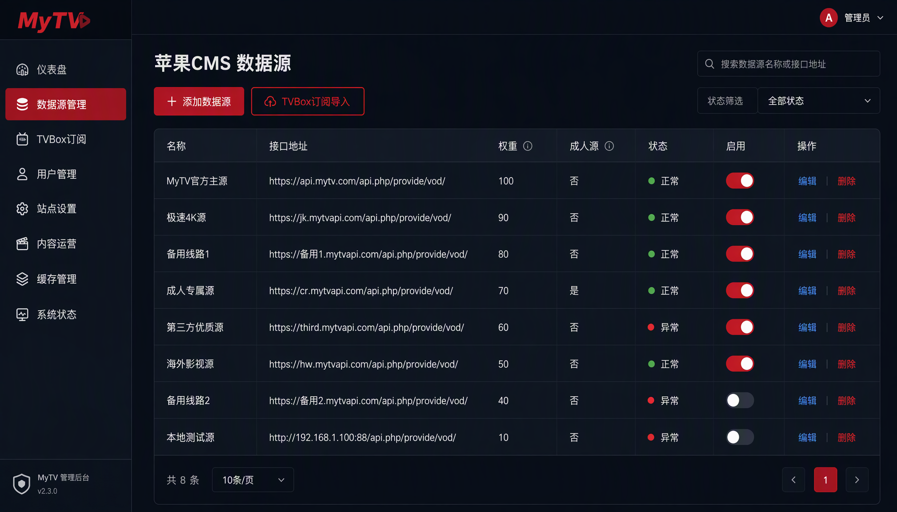

## 7. 交互与实现规格

### 7.1 信息架构
- **详情页与播放页合一**：播放页即详情落地页（含简介/收藏/选集），海报与搜索结果点击直达，减少一跳。
- 前台路由：`/`（首页）、`/search`、`/play/:source/:id(/:ep)`、`/my`、`/login`；后台路由：`/admin/*`（9.1 分离）。
- 导航：电脑顶部导航；手机底部标签栏（首页/搜索/我的）；平板顶部紧凑导航；后台独立侧边栏工作台，仅管理员从「我的 → 管理后台」进入。

### 7.2 关键交互
- Hero 轮播 5s 自动切换 + 指示点；海报 hover（desktop）放大 1.05 + 红光晕；点击直进播放页。
- 播放器：控制条 3s 无操作自动隐藏；选集网格当前集红色填充；「跳过片头」按钮按 skip_configs 出现。
- 搜索：输入即显历史/热搜，Enter 出结果；历史未登录存本地，登录后同步 D1。
- 加载：海报骨架屏；图片懒加载 + 渐变占位；失败重试占位。
- 后台表格：启用开关即时生效（乐观更新 + 失败回滚 toast）；删除二次确认。

### 7.3 主题令牌落地
CSS variables：`--bg #0B0E14`、`--elevated #131822`、`--overlay #1B2230`、`--accent #E8112D`、`--rating #F5C518`、`--text-1/2/3`；Tailwind 配置同名映射；一期仅暗色主题，令牌结构预留亮色。

### 7.4 组件清单（shadcn/ui 映射，待 #12 拍定）
基础：Button / Input / Tabs / Dialog / Toast / Skeleton / Switch / Table / DropdownMenu / Tooltip。
业务：PosterCard、HeroCarousel、EpisodeGrid、SourceTabs、PlayerBar（ArtPlayer 定制皮肤）、SearchPanel、AdminSidebar、StatCard、SourceTable。

### 7.5 后台设计基调
与前台同暗色令牌；信息密度更高、装饰收敛；圆角收窄（8px）；红色仅用于主操作与告警。
